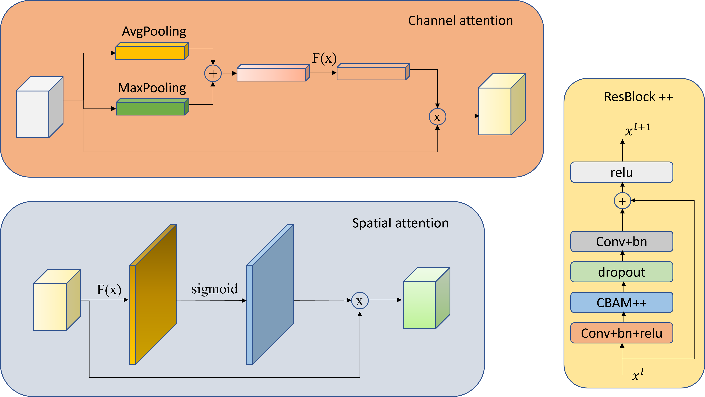

# FERNet
# Giới thiệu
- Đây là project cá nhân được thực hiện dựa trên code của repo [này](https://github.com/LetheSec/Fer2013-Facial-Emotion-Recognition-Pytorch#readme). Tuy nhiên trong project này chúng tôi cải tiến mô hình Resnet18 bằng cách thêm module CBAM++ để cải thiện độ chính xác nhận dạng. Không giống hoàn toàn như mô hình resnet18 chúng tôi sử dụng các lớp tích chập tiêu chuẩn ở 3 layer đầu và sử dụng tích chập theo chiều sâu ở layer cuối cùng.
- Trong repo này chúng tôi còn thử nghiệm thêm hàm loss batch weight kết hợp với hàm crossentropy loss.
## Mô hình FERNet


# Clone
```
git clone https://github.com/tranngocduvnvp/FERNet.git
cd FERNet
```
# Install requirements.txt
```
pip install requirements.txt
```

# Download data
```
python prepare_data.py
```
# Train
```
python train.py --name="ten model" --batch_size=128 --batch_weight=True
```

